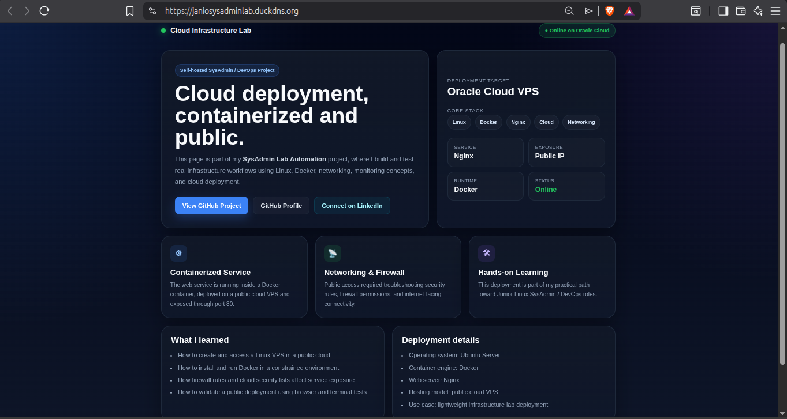
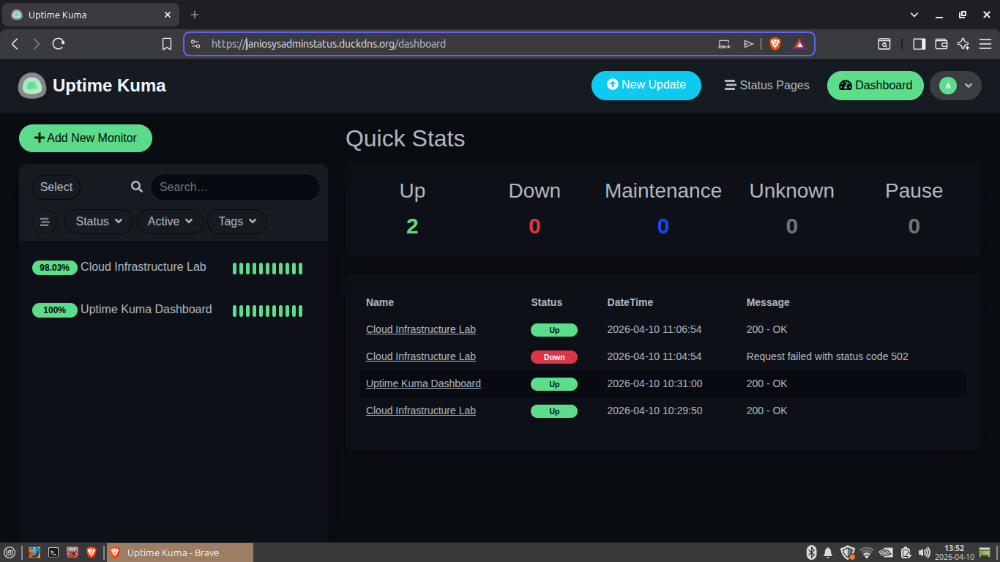
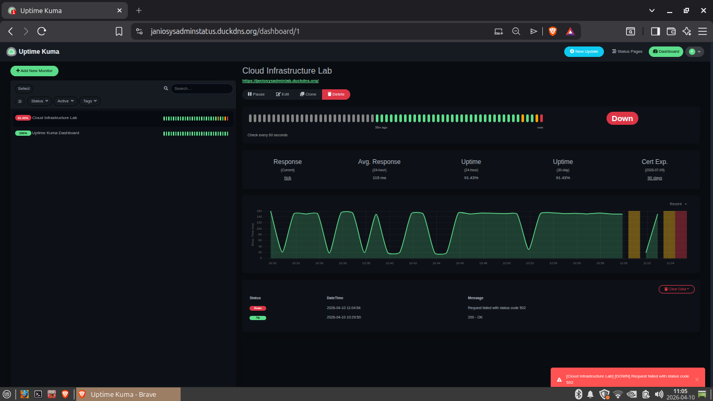
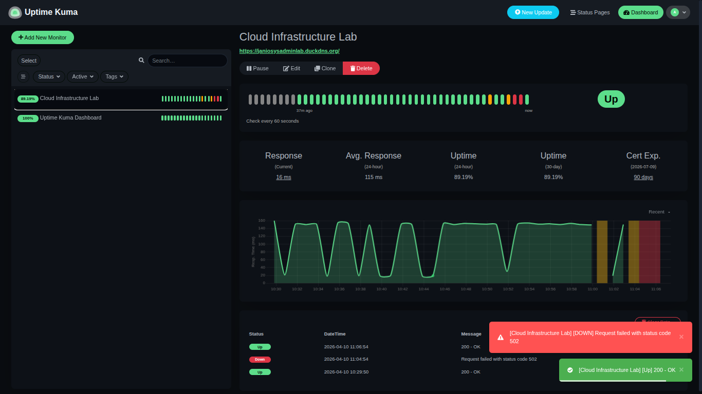
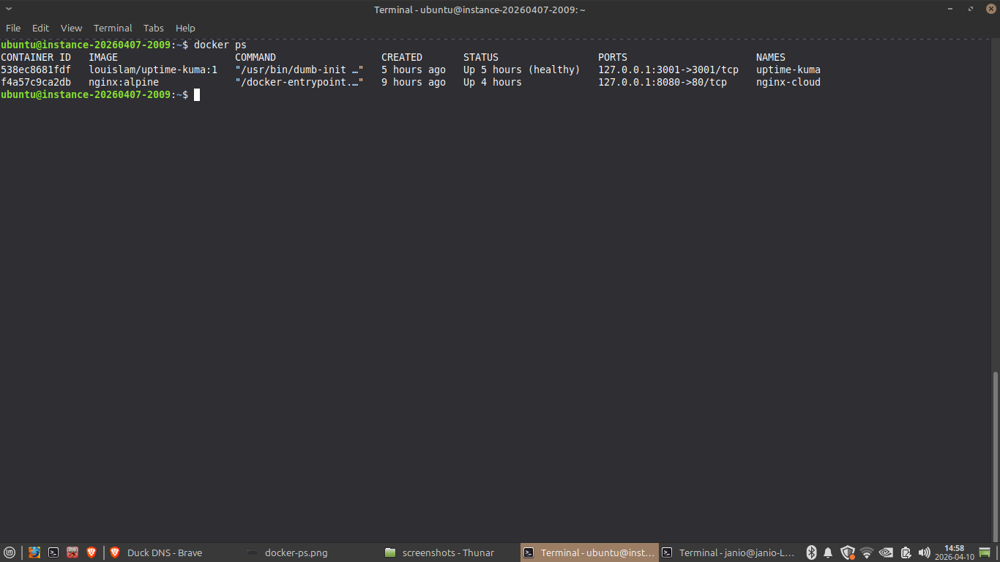
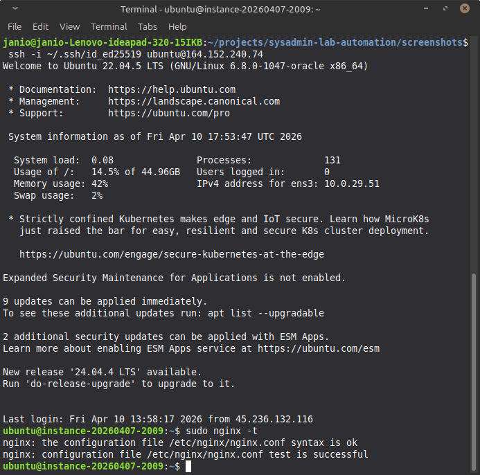

# 🚀 SysAdmin Lab Automation


A hands-on infrastructure lab built to simulate real-world **Linux SysAdmin / DevOps workflows** using **Docker**, **Nginx**, **reverse proxying**, **HTTPS**, and **service monitoring**.

This project started as a local container lab and evolved into a lightweight **public cloud deployment** hosted on **Oracle Cloud**, with real monitoring, HTTPS, and service recovery testing.

---

## 🌐 Live Links

- **Live Demo:** `https://janiosysadminlab.duckdns.org`
- **Monitoring Dashboard:** `https://janiosysadminstatus.duckdns.org`

> Note: the monitoring link currently points to the Uptime Kuma dashboard. A dedicated public status page can be added in a future iteration.

---

## 📌 Project Overview

This lab demonstrates how to build, expose, monitor, and maintain lightweight services in both **local** and **cloud** environments.

It was developed as part of my transition toward **Junior Linux SysAdmin / Linux Support roles**, with a practical focus on:

- Linux infrastructure setup
- Docker-based service deployment
- Reverse proxy configuration
- Domain and HTTPS setup
- Monitoring and uptime validation
- Troubleshooting connectivity and service availability

---

## ✅ What This Project Demonstrates

- Running containerized services with Docker
- Publishing services through a **host-level Nginx reverse proxy**
- Mapping public domains with **DuckDNS**
- Securing services with **Let's Encrypt HTTPS certificates**
- Monitoring uptime and recovery events with **Uptime Kuma**
- Simulating service failures and validating recovery
- Operating a lightweight cloud lab on a **low-resource VPS**

---

## 🧱 Architecture

### Cloud Deployment

    Browser
       ↓
    DuckDNS domain
       ↓
    Nginx on host VPS (80/443, reverse proxy, HTTPS)
       ↓
    ├── nginx-cloud container (landing page) → 127.0.0.1:8080
    └── uptime-kuma container (monitoring)  → 127.0.0.1:3001

### Local Lab

    User
       ↓
    Docker / Docker Compose
       ↓
    ├── Nginx
    ├── Portainer
    └── Uptime Kuma

---

## 🛠️ Tech Stack

- **Linux (Ubuntu Server)**
- **Docker**
- **Docker Compose**
- **Nginx**
- **Uptime Kuma**
- **Portainer**
- **DuckDNS**
- **Let's Encrypt / Certbot**
- **Basic firewall and networking configuration**
- **Cloud VPS deployment**

---

## ⚙️ Services

### 🔹 Nginx
- Runs on the **host VPS**
- Acts as the main **reverse proxy**
- Publishes internal containerized services to the internet
- Handles **HTTP to HTTPS redirection**
- Routes requests to internal services bound to loopback addresses

### 🔹 Landing Page Service
- Static infrastructure landing page
- Runs inside a Docker container
- Exposed internally on `127.0.0.1:8080`
- Published through host-level Nginx and HTTPS

### 🔹 Uptime Kuma
- Monitoring tool for service availability
- Detects downtime and recovery events
- Provides a visual dashboard for uptime checks
- Runs internally on `127.0.0.1:3001`
- Published securely through Nginx reverse proxy

### 🔹 Portainer
- Used in the local lab environment for container management
- Helps inspect services, logs, and container state
- Preserved as part of the broader lab structure

---

## ☁️ Cloud Deployment Highlights

This project was extended from a local Docker lab into a **public cloud deployment** hosted on a lightweight VPS.

### Implemented cloud-side tasks
- Public VPS setup
- Dockerized service deployment
- Host-based Nginx reverse proxy
- DuckDNS domain mapping
- HTTPS with Let's Encrypt
- Certificate renewal validation
- Firewall and connectivity troubleshooting
- Internal-only container exposure using loopback bindings

---

## 📊 Monitoring Simulation

This lab includes real monitoring scenarios using **Uptime Kuma**.

### Tested scenarios
- Service failure simulation using `docker stop`
- Automatic downtime detection
- Recovery validation using `docker start`
- Public uptime checks through HTTPS

### Example
    docker stop nginx-cloud
    docker start nginx-cloud

This allows practical testing of:

- service interruption
- monitoring accuracy
- recovery visibility
- operational troubleshooting

---

## 🧪 Real Operational Notes

During implementation, this project included practical troubleshooting such as:

- fixing conflicting Nginx server blocks
- validating DNS resolution with DuckDNS
- adjusting container exposure from public ports to loopback bindings
- configuring HTTPS certificates and testing renewal
- confirming reverse proxy behavior across multiple services
- simulating downtime for monitoring validation

---

## 🔍 Key Skills Demonstrated

- Linux system administration
- Docker container deployment
- Docker Compose orchestration
- Reverse proxy configuration with Nginx
- HTTPS setup with Let's Encrypt
- Domain-based service publishing
- Monitoring and uptime validation
- Firewall and network troubleshooting
- Lightweight VPS operations
- Service recovery testing
- Infrastructure documentation

---

## 📂 Project Structure

    sysadmin-lab-automation/
    ├── docker-lab/
    │   ├── docker-compose.yml
    │   ├── nginx/
    │   │   └── site/
    │   ├── portainer/
    │   ├── uptime-kuma/
    │   └── docs/
    ├── playbooks/
    ├── docs/
    ├── screenshots/
    └── README.md

---

## 🚀 How to Run Locally

Start the local lab:

    cd docker-lab
    docker compose up -d

---

## 🌍 Local Service Access

- **Nginx:** `http://localhost:8080`
- **Portainer:** `http://localhost:9000`
- **Uptime Kuma:** `http://localhost:3001`

---

## 📸 Screenshots

### Landing Page (HTTPS)


### Uptime Kuma Dashboard


### Service Down Detection


### Service Recovery


### Docker Containers Running


### Nginx Validation


---

## 📈 Current Status

### Implemented
- Local Docker lab
- Public VPS deployment
- Nginx reverse proxy
- DuckDNS domain access
- HTTPS with Let's Encrypt
- Certificate renewal validation
- Uptime Kuma monitoring
- Real downtime and recovery simulation

### In Progress
- Additional hardening
- Documentation refinement
- Optional private admin tooling
- Expanded monitoring scenarios

 ## 🚀 30-Day SysAdmin Challenge (Progresso Live)

   ### Dia 1: Health Check VPS ✅ (Security Fix)
   - **Script**: [health-check.sh](health-check.sh) – Uptime, memória, disco, Docker (sanitizado).
   - **Lição Security**: Removidos logs SSH reais (IPs atacantes). Nunca commit `/var/log/*` público!
   - **Comando**:
```bash
     cd ~/docker-projects/sysadmin-lab-automation
     ./health-check.sh > health-report-safe.txt
Output VPS real (12/04/2026):
=== SysAdmin Health Check - VPS Oracle Cloud (Janio Lab) ===
📅 Data/Hora: Sun Apr 12 19:52:44 UTC 2026
🖥️ Uptime:  19:52:44 up 2 days, 10:24,  1 user,  load average: 0.00, 0.13, 0.10
💾 Memória: Mem:           956Mi       330Mi        75Mi       0.0Ki       550Mi       451Mi
📊 Disco: /dev/sda1        45G  6.7G   39G  15% /
🐳 Docker Containers: NAMES         STATUS
uptime-kuma   Up 30 hours (healthy)
nginx-cloud   Up 30 hours
🔥 Processos Top: USER PID COMMAND
root 1 /lib/systemd/systemd
root 2 [kthreadd]
root 3 [pool_workqueue_release]
root 4 [kworker/R-rcu_g]
🔒 SSH Status: Status for the jail: sshd
|- Filter
|  |- Currently failed:	0
|  |- Total failed:	0
|  `- File list:	/var/log/auth.log
`- Actions
   |- Currently banned:	0
   |- Total banned:	1
   `- Banned IP list:	
---

## 📚 Lessons Learned

This project helped reinforce practical concepts such as:

- separating public exposure from internal container ports
- using a host reverse proxy instead of exposing containers directly
- troubleshooting DNS, routing, and firewall issues
- validating HTTPS configuration in real cloud conditions
- monitoring real service downtime and confirming recovery

---

## 🛣️ Next Improvements

Planned improvements for the next iterations:

- refine firewall and access policies
- improve documentation and deployment notes
- add more monitoring scenarios
- keep admin tooling private
- expand the lab with additional lightweight services

---

## 🎯 Purpose

This lab was built to gain hands-on experience with **Linux infrastructure**, **public service exposure**, **monitoring**, and **troubleshooting** in preparation for **remote Junior Linux SysAdmin / Linux Support opportunities**.

---

## 👨‍💻 Author

**Janio Vieira Rodrigues**  
Linux • Docker • Nginx • Monitoring • Infrastructure
