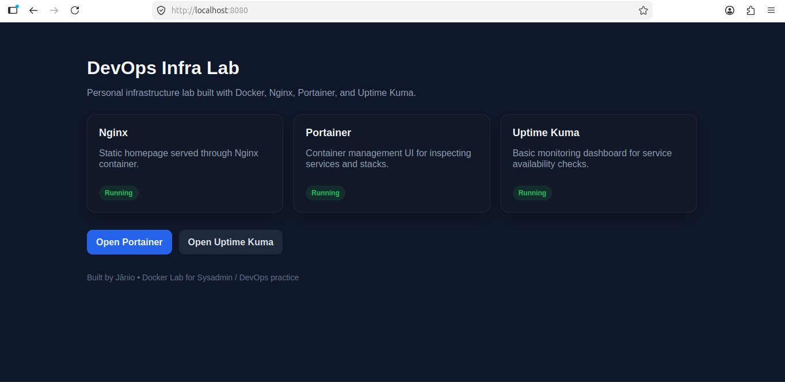
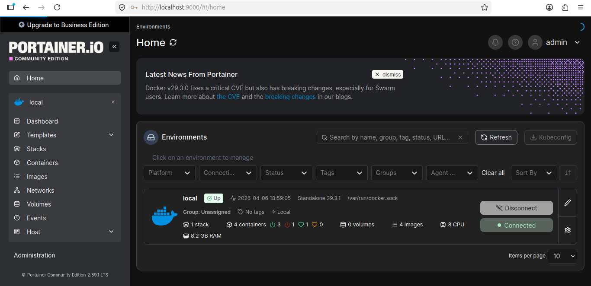
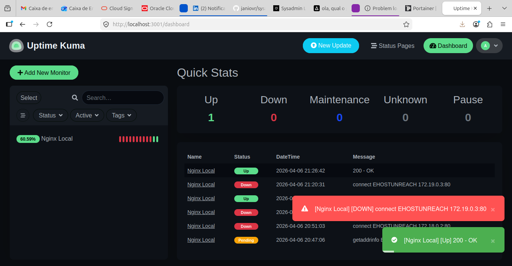

# 🚀 SysAdmin Lab Automation

A personal infrastructure lab designed to simulate real-world Sysadmin / DevOps environments using Docker, service orchestration, and monitoring.

---

## 📌 Project Overview

This project demonstrates how to build, manage, and monitor containerized services in a structured environment.

It was developed as part of my transition into a **Linux System Administrator role**, focusing on:

* Infrastructure setup
* Container management
* Service monitoring
* Troubleshooting and reliability

---

## 🧱 Architecture

```
User (Browser)
     ↓
 Nginx (Docker)
     ↓
 ├── Portainer (Container Management)
 └── Uptime Kuma (Monitoring)
```

---

## 🛠️ Tech Stack

* **Linux (Ubuntu / Oracle Linux)**
* **Docker & Docker Compose**
* **Nginx**
* **Portainer**
* **Uptime Kuma**
* **Networking (ports, services, container DNS)**

---

## ⚙️ Services

### 🔹 Nginx

* Serves a static homepage for the lab
* Entry point for testing deployments

---

### 🔹 Portainer

* Web UI for managing Docker containers
* Allows inspection, logs, and container control

---

### 🔹 Uptime Kuma

* Monitoring tool for service availability
* Detects downtime and recovery events

---

## 📊 Monitoring Simulation

This lab includes real monitoring scenarios:

* Service failure simulation (`docker stop`)
* Automatic detection of downtime
* Recovery validation (`docker start`)

Example:

```
docker stop devops-lab-nginx
docker start devops-lab-nginx
```

---

## 📂 Project Structure

```
sysadmin-lab-automation/
├── docker-lab/
│   ├── docker-compose.yml
│   ├── nginx/
│   │   └── site/
│   ├── portainer/
│   ├── uptime-kuma/
│   └── docs/
├── playbooks/
├── docs/
├── screenshots/
└── README.md
```

---

## 🚀 How to Run (Local)

```
cd docker-lab
docker compose up -d
```

---

## 🌐 Access Services

* Nginx → http://localhost:8080
* Portainer → http://localhost:9000
* Uptime Kuma → http://localhost:3001

---

## 🔍 Key Skills Demonstrated

* Containerized infrastructure setup
* Docker Compose orchestration
* Service monitoring and alerting
* Debugging container networking issues
* Simulating real-world downtime scenarios
* Organizing infrastructure projects

---

## 📸 Screenshots

(Add your screenshots here)

Example:





---

## ☁️ Cloud Deployment (Work in Progress)

This project is being extended to run on Oracle Cloud Free Tier with a lightweight deployment strategy.

---

## 🎯 Purpose

This lab was built to gain hands-on experience with real infrastructure scenarios and prepare for **remote Sysadmin / DevOps roles**.

---

## 👨‍💻 Author

**Janio Vieira Rodrigues**
Linux • Docker • Infrastructure • Monitoring
